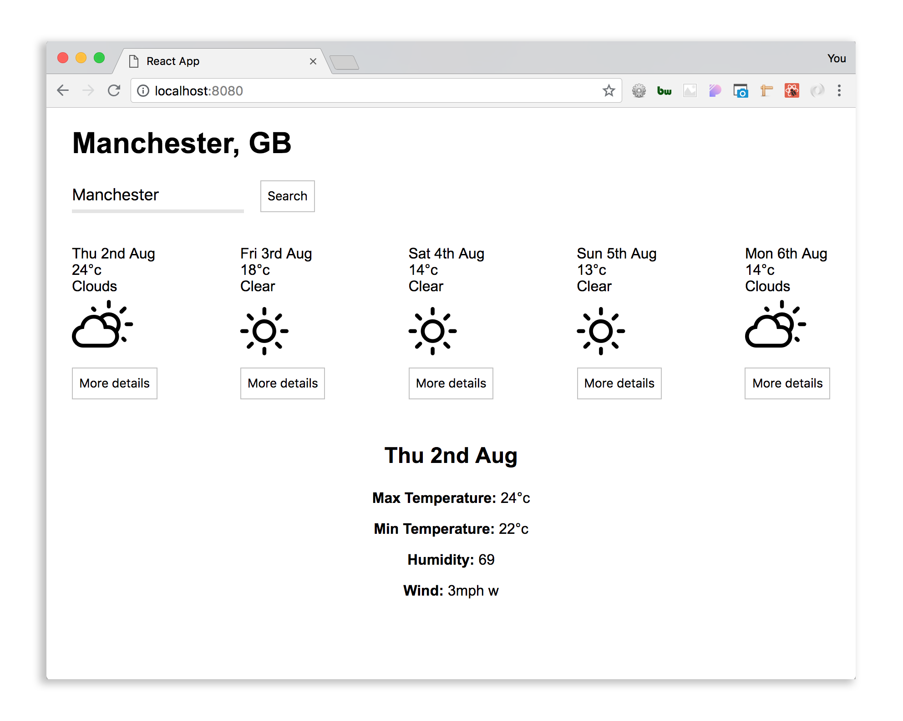

# React Weather App

Built with Manchester Codes' [React boilerplate](https://github.com/MCRcodes/react-bootstrap), the weather app has the following features:
* Users can see the name and country of the city the forecast is for.
* Users can see a summary of each day of the forecast, including the date, general description of the weather that day, and maximum temperature.
* Users can click on one of the summaries to view all of the forecasted information for that date
* Users can enter the name of a city and search for that forecast




## Install

```bash
git clone git@github.com:cloverc/weather-app.git
cd weather-app
npm i
npm start
```
